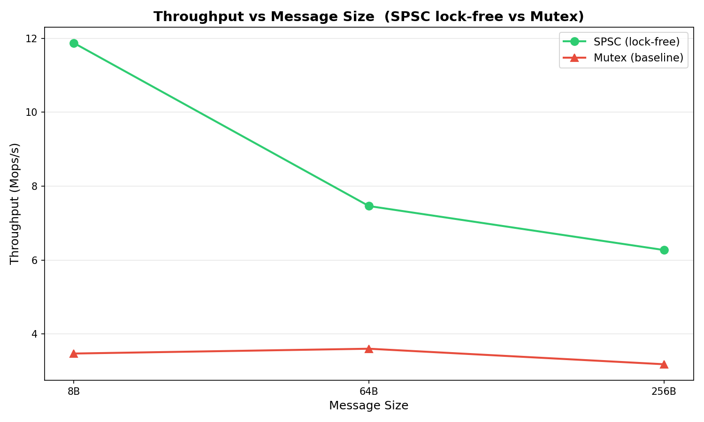

# Low-Latency Lock-Free Queues

High-performance, lock-free queue implementation in C++17 for low-latency systems — compared head-to-head against a mutex baseline.

## Queue Implementations

### `SPSCQueue<T, Capacity>` — Lock-Free Single-Producer / Single-Consumer

A bounded ring buffer using two cache-line-separated atomics (`head_` for the producer, `tail_` for the consumer). The hot path uses **only acquire/release loads and stores** — no CAS, no locks, no syscalls.

- **Power-of-2 buffer size** — bitwise mask replaces modulo for index wrapping.
- **One slot reserved** to distinguish full from empty without a separate counter.
- **Cache-line padding** between `head_` and `tail_` eliminates false sharing.

### `MutexQueue<T, Capacity>` — Baseline (Control Group)

A thread-safe bounded queue using `std::mutex` + `std::condition_variable`. Serves as the **control group** for benchmarking — every lock-free optimization is measured against this.

## Design Decisions

| Decision | Rationale |
|---|---|
| **Power-of-2 ring buffers** | `index & mask` is a single AND instruction vs. `index % size` which compiles to division. On the hot path this matters. |
| **Cache-line padding** (`alignas(64)`) | Producer and consumer atomics on separate cache lines prevent false sharing — the #1 killer of lock-free performance on multi-core. |
| **No CAS on the hot path** | Compare-and-swap generates a `LOCK CMPXCHG` which takes the cache line exclusive and retries on contention. Acquire/release loads and stores (`MOV` + fences) are strictly cheaper. |

## Build & Run

Requires **g++ with C++17 support** and **pthreads**.

```bash
# Compile and run all correctness tests
make run

# Compile and run the standalone benchmark (emits CSV)
make run-bench

# Generate throughput chart (requires matplotlib)
make plot

# Clean all build artifacts
make clean
```

## Benchmark Results

The standalone benchmark (`bench/benchmark.cpp`) compares SPSC lock-free vs mutex baseline across:
- **Message sizes**: 8B, 64B, 256B
- **3 iterations per configuration**, reporting the median

Results are written to `bench_results.csv`. Run `make plot` to generate the chart below.

### Throughput vs Message Size



## Project Structure

```
├── include/
│   ├── spsc_queue.h          # Lock-free SPSC queue
│   └── mutex_queue.h         # Mutex baseline queue
├── tests/
│   ├── test_spsc_queue.cpp   # SPSC correctness tests + inline bench
│   └── test_mutex_queue.cpp  # Mutex correctness tests + inline bench
├── bench/
│   ├── benchmark.cpp         # Standalone head-to-head benchmark
│   └── plot.py               # Chart generation script
├── Makefile                  # Build system
├── output.log                # Test output log
├── bench_results.csv         # Benchmark results (generated)
└── throughput_vs_msgsize.png # Chart (generated)
```
